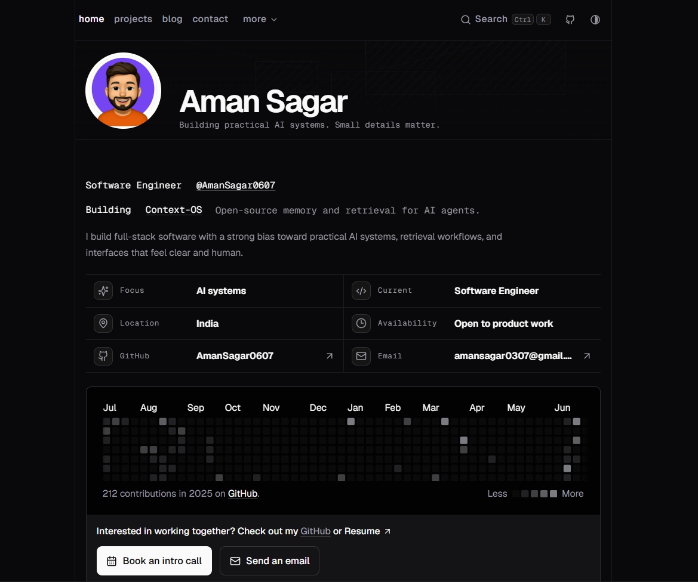

<p align="center">
  
</p>

# amansagar.in

<p align="center">
  <a href="#readme">README</a> ·
  <a href="#code-of-conduct">Code of conduct</a> ·
  <a href="#mit-license">MIT license</a>
</p>

<p align="center">
  <a href="https://amansagar.in">Live site</a> ·
  <a href="https://github.com/AmanSagar0607/amansagar.in">GitHub repository</a>
</p>

<p align="center">
  <a href="https://github.com/sponsors/AmanSagar0607">
    
  </a>
</p>

<p align="center">
  
  
  
  
  
</p>

<p align="center">
  
  
  
</p>

<p align="center">
  
  
  
</p>


A personal portfolio for [amansagar.in](https://amansagar.in), built with Next.js, MDX, Tailwind CSS, and shadcn/ui.

## About

This repo is meant to be used as a reference, a fork, or a starting point for your own portfolio.

## Topics

`nextjs` `portfolio` `mdx` `tailwindcss` `shadcn-ui` `typescript` `blog` `design-system`

## Tech Stack

- Next.js
- TypeScript
- MDX
- Tailwind CSS
- shadcn/ui

## Featured

- Blog, projects, experience, and contact sections
- MDX-powered writing and content pages
- Responsive navigation and section-based layout
- Reusable UI patterns for cards, lists, and content panels
- Built for easy customization and experimentation

## Use This

1. Clone the repository.
2. Install dependencies with `npm install`.
3. Run the development server with `npm run dev`.
4. Replace links, images, metadata, and personal details with your own.
5. Update `src/app/page.tsx`, `src/content/posts`, and shared components as needed.

## Contribute

Contributions are welcome if you want to improve the template, fix bugs, or polish the UI.

If you use this project as a base for your own site, a credit link back to the original repository is appreciated.

## Support

- Sponsor the project through [GitHub Sponsors](https://github.com/sponsors/AmanSagar0607)
- Share feedback through issues or pull requests

## Contributors

- [Aman Sagar](https://github.com/AmanSagar0607)

## Development

```bash
npm install
npm run dev
```

Open [http://localhost:3000](http://localhost:3000) to preview the site.

## License

Released under the MIT License. See [`LICENSE`](LICENSE).

## Code of Conduct

Be respectful, constructive, and helpful. Keep feedback focused on the work, and avoid harassment, hate, or abusive behavior.

## Related

- Live site: [amansagar.in](https://amansagar.in)
- GitHub: [AmanSagar0607/amansagar.in](https://github.com/AmanSagar0607/amansagar.in)
